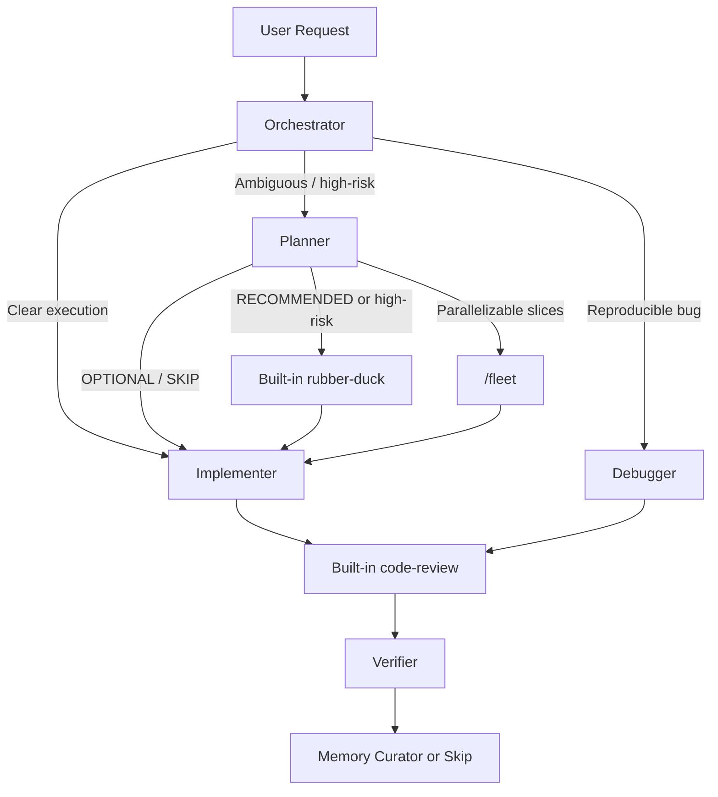

# Copilot CLI Hive

⚡ Turn GitHub Copilot CLI into a governed multi-agent delivery system.

This repository is a CLI-native control plane. It keeps the strongest ideas from the original VS Code-oriented workflow set, but rewrites the operating model around the primitives Copilot CLI already provides well:

- custom agents for phase ownership
- built-in agents for generic discovery, command work, research, and review
- skills for domain specialization
- hooks for deterministic guardrails
- `.agent-memory/` for durable repo knowledge

Clone it, adapt it, and use it as a serious foundation for agentic delivery, not a demo prompt pack.

## 👥 Who This Is For

- teams who want one clear entrypoint instead of agent sprawl
- engineers who want planning, review, verification, and memory discipline around Copilot CLI
- people building a reusable starter for real delivery work, not a one-off prompt experiment

## 🔥 Why This Is Useful

- 🧭 One real control plane: `orchestrator` owns routing, review, debug loops, memory decisions, and delegation boundaries.
- ✅ Independent acceptance gate: `verifier` checks objective evidence instead of trusting implementation momentum.
- 🧠 Planning with structure: `planner` uses explicit tracks, readiness gates, causal-path thinking, and verification parity.
- 🔎 Built-ins without chaos: `explore`, `task`, `code-review`, `research`, and `rubber-duck` are reused deliberately instead of cloned badly.
- 🗂️ Durable memory without repo pollution: shipped `.agent-memory/` stays starter-safe for downstream adopters.

## 🙏 Credits

Based on:

- [burkeholland gist](https://gist.github.com/burkeholland/0e68481f96e94bbb98134fa6efd00436)
- [simkeyur/vscode-agents](https://github.com/simkeyur/vscode-agents)
- [github/awesome-copilot](https://github.com/github/awesome-copilot)
- [AlexGladkov/claude-code-agents](https://github.com/AlexGladkov/claude-code-agents)
- [mrvladd-d/memobank](https://github.com/mrvladd-d/memobank)

Inspired by:

- [ruvnet/ruflo — Hive-Mind Intelligence](https://github.com/ruvnet/ruflo)

## ⚔️ Why This Repo vs Prompt Pack

- A prompt pack gives you personas. This repo gives you a control plane.
- A prompt pack can sound smart while drifting. This repo adds routing, readiness, review, verification, and memory discipline.
- A prompt pack is easy to demo. This repo is built to survive real engineering work.

## 🧩 Agents At A Glance

| Agent | Kind | Primary Role | Typical Use |
| --- | --- | --- | --- |
| `orchestrator` | Custom | routing, governance, phase control | default entrypoint |
| `planner` | Custom | ambiguity resolution, planning, readiness | non-trivial or unclear work |
| `implementer` | Custom | code changes and execution-ready delivery | planned implementation |
| `debugger` | Custom | reproduction, root cause, minimal fix | stable bug signal |
| `verifier` | Custom | independent acceptance validation | after non-trivial changes |
| `memory-curator` | Custom | durable memory updates | after verified durable lessons |
| `explore` | Built-in | fast targeted scouting | discovery-first routing |
| `task` | Built-in | command-heavy execution | tests, builds, lints, installs |
| `research` | Built-in | external research | current APIs, docs, dependencies |
| `code-review` | Built-in | high-signal bug and risk review | after implementation |
| `rubber-duck` | Built-in | critique and second opinion | after planning on risky work |
| `general-purpose` | Built-in | fallback delegation | when no narrower fit exists |

## 🏗️ How The System Works

### 🗺️ Planning stays explicit

Planning uses three tracks:

- `Quick Change`
- `Feature Track`
- `System Track`

Every non-trivial plan must end with `Implementation Readiness: PASS` or `BLOCKED`.

### 🧪 Verification stays independent

Execution does not close the loop by itself. Non-trivial work should flow through `code-review` when appropriate, then `verifier`, then `memory-curator` when the outcome creates durable knowledge.

### 🔄 Workflow Map



## 🧰 What's Inside

```text
.
├── AGENTS.md
├── README.md
├── .github/
│   ├── agents/
│   │   ├── orchestrator.agent.md
│   │   ├── planner.agent.md
│   │   ├── implementer.agent.md
│   │   ├── debugger.agent.md
│   │   ├── verifier.agent.md
│   │   └── memory-curator.agent.md
│   ├── copilot-instructions.md
│   ├── hooks/
│   │   └── policy.json
│   └── skills/
├── .agent-memory/
├── hooks/
    └── bin/

```

## 🚀 How To Run It

1. Start with `orchestrator` unless you explicitly want a planning-only session.
2. Let `planner` resolve ambiguity before code when scope, behavior, or verification is unclear.
3. Standard path for non-trivial work: `orchestrator -> planner -> rubber-duck (when recommended or high-risk) -> implementer/debugger -> code-review -> verifier`.
4. Use `implementer` for general delivery work and `debugger` only for reproducible bugs.
5. Route completed work through `code-review` when the change is multi-file, user-visible, or integration-heavy, then through `verifier`.
6. Persist durable lessons through `memory-curator` instead of ad hoc notes.

## 🎯 Current Scope

Included now:

- repository instructions and runtime guardrails
- agent set
- hook guardrails
- initial memory policy

Delayed to later phases:

- automated worktree management
- multi-review consolidation
- spec/code drift reconciliation
- plugin packaging and distribution

## ✅ Runtime Status

This repository is now aligned to Copilot CLI runtime behavior. Legacy VS Code-specific agent splitting and metadata are no longer part of the active architecture.
